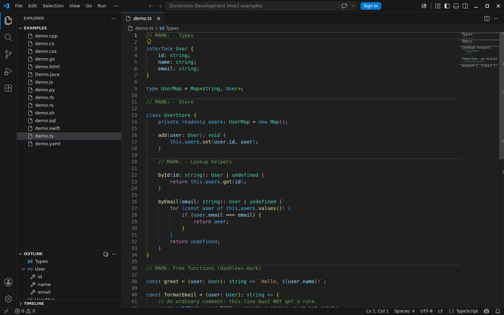
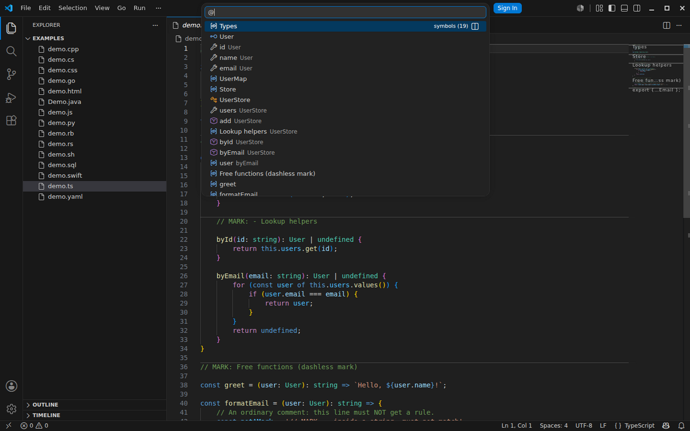
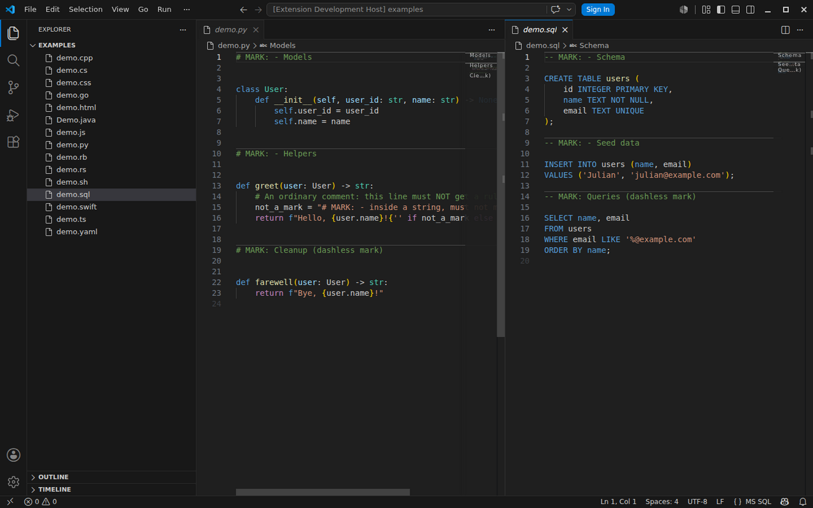
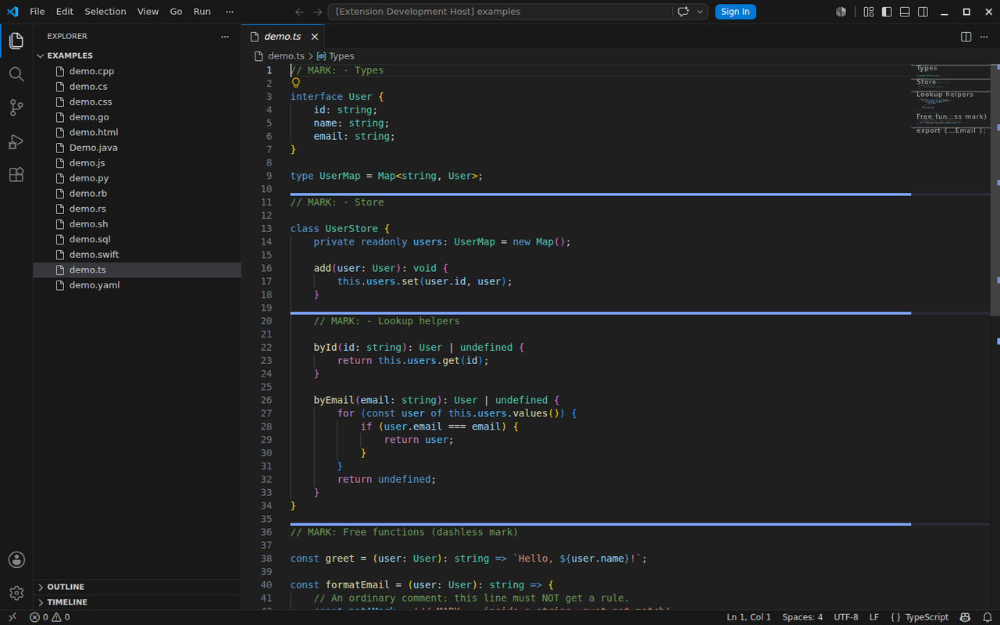

# Mark Highlight — Xcode-style `// MARK:` comments for VSCode

[](https://github.com/JulianAnthes/vscode-mark-highlight/actions/workflows/code-quality.yml)
[](https://codecov.io/github/JulianAnthes/vscode-mark-highlight)
[](https://code.visualstudio.com/)
[](https://prettier.io/)
[](LICENSE)

Give a section of code a name once, and see it everywhere:

```ts
// MARK: - Networking
```

That single comment becomes a **full-width divider** in the editor, an **entry
between your real symbols** in the Outline, breadcrumbs, and Go to Symbol
(`Cmd+Shift+O`), a **tick** in the overview ruler, and a **section label** in
the minimap.



## Why Mark Highlight

- **Navigate by intent, not just by symbol.** Long files don't get shorter —
  but "Types", "Store", "Lookup helpers" are how you actually think about
  them. Marks make those sections jumpable instead of scroll-and-squint.
- **One merged list, not a second tree.** The usual approach — a separate
  symbol provider — splits the Outline into a "MARK" group next to
  "TypeScript", because VSCode
  [cannot merge outline trees](https://github.com/microsoft/vscode/issues/60641).
  Mark Highlight instead injects marks **into TypeScript's own symbol tree**
  via a bundled tsserver plugin: one list, ordered by position, with marks
  nesting into their containing class exactly like Xcode.
- **Every language, zero setup.** Each language's real comment tokens are
  discovered from its own configuration: `//` in TS/Go/Rust/Swift, `#` in
  Python/Ruby/Shell/YAML, `--` in SQL/Lua, `/* */` in CSS, `<!-- -->` in
  HTML — including any third-party language you install.
- **Two features that can never disagree.** The divider and the outline entry
  come from one shared parser, so what you see in the code is always what
  you get in navigation — no more stacking two extensions and hoping they
  match.
- **Light and live.** Mark-free files cost one substring scan; updates are
  debounced while typing; every setting applies instantly, no reload.

## Quick start

1. Install the extension.
2. Type `// MARK: - Section name` on its own line (or `# MARK: -`,
   `-- MARK: -`, ... — whatever your language's comment is).
3. Jump to it via the Outline, breadcrumbs, or `Cmd+Shift+O`.

The dash is optional (`// MARK: Section` works too), and a bare `// MARK: -`
draws a plain divider without a title — same conventions as Xcode.

## The Outline stays one list

Marks are mirrored into symbol navigation **between** the real symbols — no
separate "MARK" group in TypeScript files. Note how `Lookup helpers` nests
inside `UserStore`:



## Every language with comments

Marks are parsed with each language's own comment tokens:



## Make it yours

The rule's color, style, and width are configurable — thick rules render as a
band in the blank space above the mark line, never over your code:



## Settings

| Setting                      | Default                    | Description                                                                                                                                                                                                                                                            |
| ---------------------------- | -------------------------- | ---------------------------------------------------------------------------------------------------------------------------------------------------------------------------------------------------------------------------------------------------------------------- |
| `markComments.enabled`       | `true`                     | Master switch for both features.                                                                                                                                                                                                                                       |
| `markComments.keyword`       | `"MARK: -"`                | Keyword that starts a mark. A trailing `-` is optional when matching, so `// MARK: - Title`, `// MARK:- Title`, and `// MARK: Title` all match the default.                                                                                                            |
| `markComments.languages`     | `["*"]`                    | Language IDs to process. `"*"` covers every language that declares comment syntax, each parsed with its own comment tokens (`#` for Python, `--` for Lua/SQL, `<!-- -->` for HTML, ...).                                                                               |
| `markComments.borderColor`   | `"rgba(128,128,128,0.45)"` | Rule color (any CSS color); also used for the overview-ruler tick.                                                                                                                                                                                                     |
| `markComments.borderStyle`   | `"solid"`                  | `solid`, `dashed`, `dotted`, or `double`.                                                                                                                                                                                                                              |
| `markComments.borderWidth`   | `"1px 0 0 0"`              | CSS border-width (top right bottom left) — the default draws a top rule only. Top-only rules thicker than 1px are drawn as a band in the blank space above the mark line, so they never paint over the mark text (decorations are overlays and cannot push text down). |
| `markComments.overviewRuler` | `true`                     | Show a tick per mark in the right-hand overview ruler.                                                                                                                                                                                                                 |

All settings apply live — no reload needed.

## How it works

Both features key off a single pure function, `findMarks(text, keyword)` in
`src/core/findMarks.ts`, so they can never disagree about what counts as a
mark. That module imports nothing from `vscode`, which is what lets the Vitest
unit tests run without an extension host. A thin adapter maps its results to
`vscode.Range`s.

- **Outline (TS/TSX/JS/JSX)**: a bundled **tsserver plugin** (`src/tsPlugin/index.ts`, shipped in `dist/ts-plugin/` and installed into the extension's `node_modules/` on activation — the only location tsserver loads plugins from) proxies `getNavigationTree` and injects one node per mark into TypeScript's own symbol tree. Because the marks live inside the TypeScript provider's results, the Outline stays a **single interleaved list** — a separate `DocumentSymbolProvider` would render as its own tree next to "TypeScript" ([microsoft/vscode#60641](https://github.com/microsoft/vscode/issues/60641)). Marks nest into the node that contains them (a mark inside a class body appears under the class), like Xcode.
- **Outline (other configured languages)**: a regular `DocumentSymbolProvider` emits flat `SymbolKind.Key` symbols. For languages with no other symbol provider (plain SQL, shell scripts, ...) the marks simply are the outline. For languages that do have one (CSS/HTML built-ins, Pylance for Python, ...), VSCode renders one Outline tree per provider and cannot merge them ([#60641](https://github.com/microsoft/vscode/issues/60641)) — marks there appear as their own "MARK" group next to the language's tree. A true merge is only possible where a language server exposes a plugin API, which today is TypeScript only. `Cmd+Shift+O` always navigates marks and symbols merged, regardless of language.
- **Per-language comment syntax** (`src/commentSyntax.ts`): each language's line/block comment tokens are discovered from the `language-configuration.json` its contributing extension ships — the same data VSCode uses for toggle-comment — so any installed language works without configuration. Marks match a line comment with only whitespace before it, a block comment that opens and closes on its own line (including the JSDoc `/** MARK: x */` form), or — inside a multi-line C-style block (`/**`/`/*` ... `*/`) — its opening line or a `*`-gutter continuation line, so a mark on its own line in a multi-line JSDoc/block comment is found. Languages that declare no comments (plaintext, markdown, ...) are skipped.
- **Rule**: a single `TextEditorDecorationType` with `isWholeLine: true` and a configurable top border, applied to the mark lines of every visible editor. Decoration updates are debounced ~150 ms while typing and applied immediately on editor switches and settings changes.

### Why the plugin config travels through a file

VSCode runs two tsserver processes and routes `navtree` (document symbols) to
the **syntax** server, while the `configurePlugin` API request only ever
reaches the **semantic** server. Settings therefore reach the plugin through a
`config.json` written next to the installed plugin, which it re-reads
(mtime-cached) on every request; `configurePlugin` is still sent as a
secondary channel. Two more cache layers are handled on settings changes: the
TS extension's per-document navtree response cache is evicted via a throwaway
symbol request, and VSCode's outline-model cache is invalidated by
re-registering our symbol provider (which is registered for TS languages too —
returning no symbols there — precisely so it participates in that cache key).

## Scope notes (deliberate choices)

- **Whole-line comments only.** A mark matches a line comment with nothing but whitespace before it (`// MARK: x`, `# MARK: x`, `-- MARK: x`), a block comment occupying the whole line (`/* MARK: x */`, `/** MARK: x */`, `<!-- MARK: x -->`), the opening line of a multi-line C-style block (`/** MARK: x` with its close on a later line), or a `*`-gutter line inside one (` * MARK: x`), so multi-line JSDoc/block comments work. Trailing comments (`foo(); // MARK: x`) are not matched. A gutter or opener line only counts when the surrounding block is real — a bounded scan confirms an unclosed `/*` opens above a `* MARK:` line, and that a `/* MARK:` opener actually closes below — so a stray `* MARK:` inside a string literal or after an already-closed block is not a false positive.
- **Keyword matching is case-sensitive**, like Xcode.
- **Empty titles** (`// MARK: -`) still draw a rule; in the Outline they show as `MARK`.
- **Mark icon**: in TS-family files marks show the _Variable_ icon — tsserver plugins can only emit `ScriptElementKind` strings, and the TS extension maps everything outside its known set (module/class/enum/interface/method/property/variable/function/constructor) to `SymbolKind.Variable`. Non-TS languages use the key icon (`SymbolKind.Key`).
- **Workspace-specific settings across multiple windows**: the tsserver plugin reads one shared config file per extension install, so two windows whose workspaces configure different keywords will share the most recently written one. User-level settings behave as expected.
- **No minimap text labels from this extension.** The public VSCode API has no way for an extension to draw text into the minimap; the overview-ruler tick is the supported substitute. That said, VSCode itself (1.85+) natively renders `// MARK:` comments as minimap section headers when `editor.minimap.showMarkSectionHeaders` is on (the default) — so with the default keyword you get minimap labels anyway, courtesy of the editor.
- Outline interleaving assumes the Outline's default **Sort By: Position**; sorting by name or category groups the marks together instead.

## Development

```bash
npm install
npm test              # Vitest unit tests for the parser
npm run test:coverage # + v8 coverage (coverage/index.html)
npm run typecheck     # tsc --noEmit
npm run build         # esbuild → dist/extension.js
npm run package       # vsce package → .vsix (not published)
```

### Regenerating the README screenshots

`docs/*.png` are generated, not hand-made. `scripts/screenshots.mjs` launches
the `@vscode/test-electron`-managed VSCode with the extension in development
mode; a scene driver (`scripts/screenshotScenes.cjs`, injected via
`--extensionTestsPath`) opens the example files, arranges the layout, and
tweaks settings per scene; the window is then captured and trimmed with
ImageMagick.

```bash
xvfb-run -a npm run screenshots   # Linux/CI (needs xvfb + imagemagick)
npm run screenshots               # macOS (visible window, uses screencapture)
```

Press **F5** to launch the Extension Development Host with the `examples/`
folder open — one `demo.*` file per language (TypeScript, JavaScript, Python,
Go, Rust, Java, C++, C#, Swift, Ruby, Shell, SQL, HTML, CSS, YAML), each using
its own comment syntax. They double as manual test fixtures and as material
for marketplace screenshots.

The tsserver plugin builds to `dist/ts-plugin/` (what the vsix ships) and is
also copied to `node_modules/vscode-mark-highlight-ts-plugin/` — the only
location tsserver loads plugins from. The build does this copy for the F5 dev
host; in an installed extension the activation code does it (and restarts the
TS server once when it had to). After changing `src/tsPlugin/`, rebuild and
run **TypeScript: Restart TS Server** in the dev host — the plugin is loaded
once at server start.
